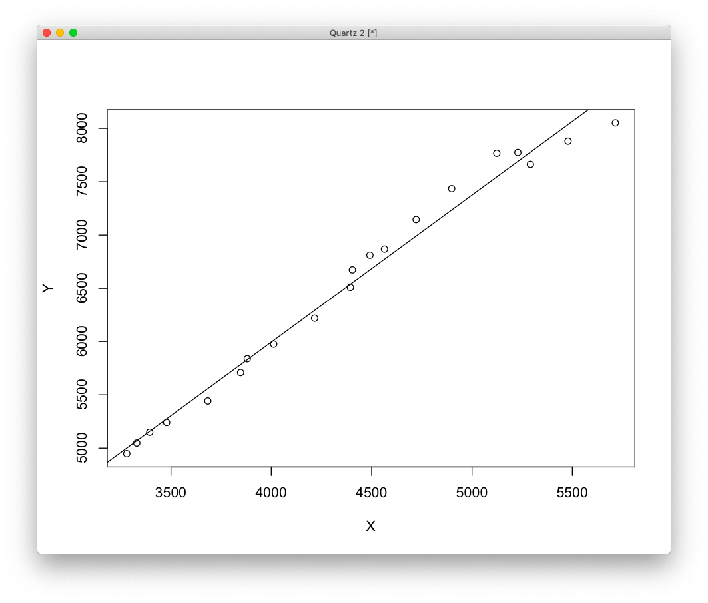
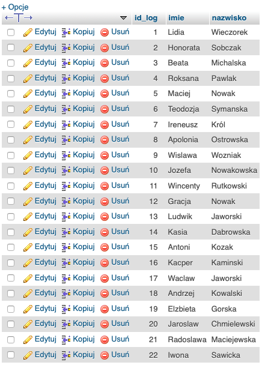
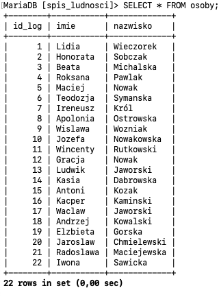

# Witaj w moim projekcie

## Regresja liniowa
Tu chciałbym pokazać regresje liniową.

Podam kod a nastepnie wykres ktory powstał na podstawie niego. 


### Kod


```R

#wspolrzedne
Y=c(8051.5,7880.2,7662.8,7774.2,7766.4,7434.9,7145.4,6868.6,6811.1,6673.3,6509.6,6218.9,5975.5,5838.7,5708.7,5442.2,5240.5,5149.1,5047.7,4947.8)
X=c(5714.3,5478.6,5291,5228.5,5123.5,4898.8,4721.7,4563.9,4491.4,4404.1,4394.1,4215.9,4012.2,3880.6,3847.2,3683.8,3478.5,3394.3,3329.8,3279.9)

#regresja liniowa
model=lm(Y~X)

#rysowanie wykresu
plot(X,Y);

#linia prosta o parametrach pobranych z obiektu model
abline(model)
```


### Model regresji liniowej 



## Baza danych mySQL 


### Kod

```sql


CREATE DATABASE spis_ludnosci;
use spis_ludnosci;


CREATE TABLE osoby (
id_log int AUTO_INCREMENT not null, PRIMARY KEY (id_log),
imie VARCHAR(30) not null,
nazwisko VARCHAR(30) not null
);


INSERT INTO `osoby` (`imie`, `nazwisko`) VALUES
('Lidia', 'Wieczorek'),
('Honorata', 'Sobczak'),
('Beata', 'Michalska'),
('Roksana', 'Pawlak'),
('Maciej', 'Nowak'),
('Teodozja', 'Symanska'),
('Ireneusz', 'Król'),
('Apolonia', 'Ostrowska'),
('Wislawa', 'Wozniak'),
('Jozefa', 'Nowakowska'),
('Wincenty', 'Rutkowski'),
('Gracja', 'Nowak'),
('Ludwik', 'Jaworski'),
('Kasia', 'Dabrowska'),
('Antoni', 'Kozak'),
('Kacper', 'Kaminski'),
('Waclaw', 'Jaworski'),
('Andrzej', 'Kowalski'),
('Elzbieta', 'Gorska'),
('Jaroslaw', 'Chmielewski'),
('Radoslawa', 'Maciejewska'),
('Iwona', 'Sawicka');

```

### Rezultat - powstała baza





Widok w XAMPP i w Terminalu.


##### Michał Michalski nr albumu: 110189

